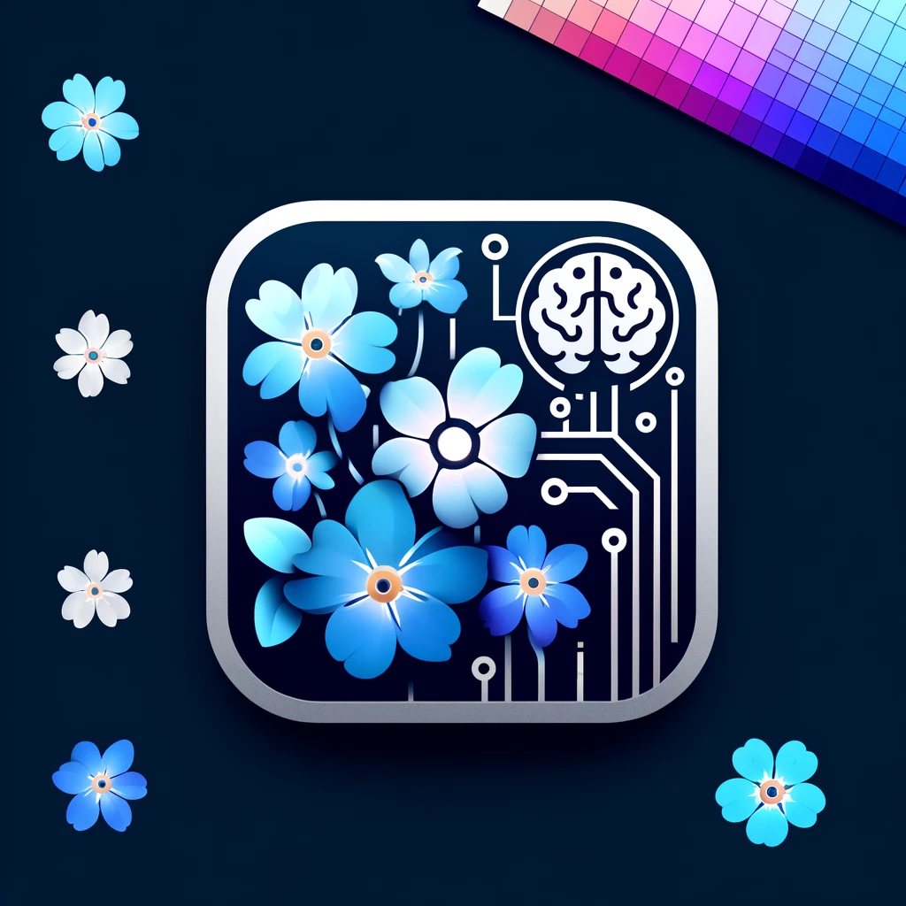

# Myosotis (forget-me-nots)
Our app, Myosotis, leverages mixed reality to enhance everyday organization and memory. Just by holding an item in front of your device, Myosotis identifies it and instantly guides you to where similar items are stored in your space, using visual and auditory cues. It's like having a photographic memory assistant—it not only helps you place items efficiently but also recalls them when needed. Perfect for personal use or enhancing productivity in professional settings, Myosotis bridges the gap between the physical and digital worlds, ensuring you never lose track of your belongings again.